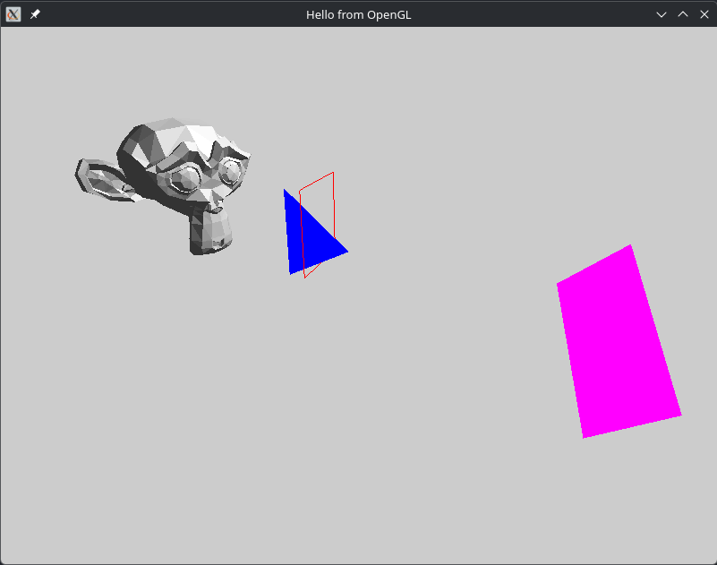

This is some 3d stuff with OpenGL for learning.

# Controlls

- Left Mouse Button - toggle capturing cursor (for looking around)
- Mouse - look around
- Scroll Wheel - change fov
- WASD - moving
- Left Shift (hold) - slow moving speed
- Q/E - move down/up
- F - toggle flat and smooth shading on the model
- Space - toggle displaying model wireframe
- N - toggle displaying vertex normals
- 1 (on top row) - open second window
- Esc - close program
